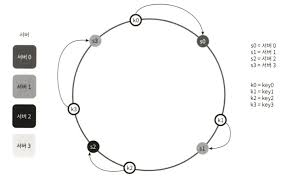

### 안정 해시
* 수평적 규모 확장성을 달성하기 위해서는 요청 또는 데이터를 서버에 균등하게 나누는 것이 중요하다.
* 안정 해시는 이 목표를 달성하기 위해 보편적으로 사용하는 기술이다.

**해시 키 재배치 문제**
* N개의 캐시 서버가 있다고 하자. 이 서버들에 부하를 균등하게 나누는 보편적 방법은 `serverIndex = hash(key) % N (N은 서버 개수)`
* 서버 풀의 크기가 고정되어 있을 때, 그리고 데이터 분포가 균등할 때는 잘 동작한다.
  * 하지만 서버가 추가, 삭제되면 문제가 생긴다.
  * 키가 재분배되어, 캐시 클라이언트가 데이터가 없는 엉뚱한 서버에 접속하게 되어 캐시 미스가 발생한다.

**안정 해시**

* 해시 테이블 크기가 조정될 때 평균적으로 오직 k/n개의 키만 재배치하는 해시 기술이다. 여기서 k는 키의 개수이고 n은 슬롯 개수다.
* 안정 해시는 전통적 해시 테이블과 다르게 모듈로 연산(%)으로 대상을 탐색하지 않으며, Hash Ring을 만들어 링 위에서 첫번째 만나는 것을 대상으로 한다.
* 안정 해시 기본 구현법의 문제
  * 균등 분포 해시 함수를 사용 
  * 시계 방향 첫 번째의 서버를 지정하는 것 
  * 이 해시의 문제점은 균등 분포 해시 함수를 사용해도 해시 파티션(인접한 서버 사이의 해시 공간)의 크기를 균등하게 유지하는게 불가능 하다는 것과 이로 인해 키가 균등하게 분포되기 어렵다는 문제가 있다.
  * 이를 해결 하기 위해 가상노드(Virtual Node) or 복제(Replica)라 불리는 기법을 사용한다.

