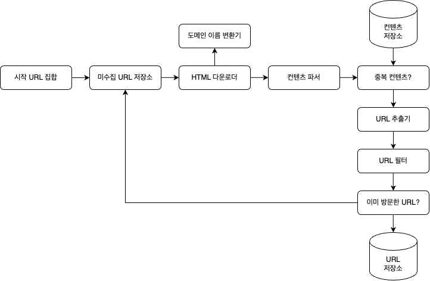
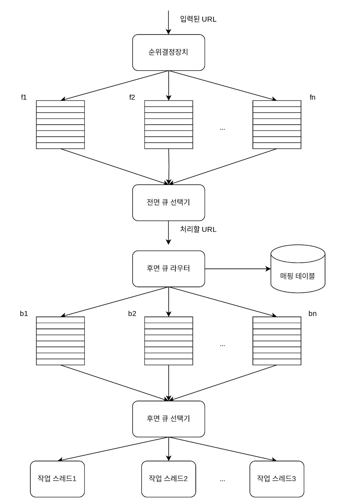

### 웹 크롤러 설계
* 검색 엔진에서 널리 쓰는 기술로, 웹에 새로 올라오거나 갱신된 콘텐츠를 찾아내는 것이 주된 목적이다.
  * 여기서 콘텐츠는 웹 페이지일 수도 있고, 이미지나 비디오, 또는 PDF 파일일 수도 있다.
* 검색 엔진 인덱싱: 크롤러의 가장 보편적인 용례다. 크롤러는 웹 페이지를 모아 검색 엔진을 위한 로컬 인덱스를 만든다. 일례로 Googlebot은 구글 검색 엔진이 사용하는 웹 크롤러다.
* 웹 아카이빙: 나중에 사용할 목적으로 장기보관하기 위해 웹에서 정보를 모으는 절차를 말한다. 많은 국립 도서관이 크롤러를 돌려 웹 사이트를 아카이빙하고 있다. 대표적으로 미국 국회 도서관, EU 웹 아카이브다 있다.
* 웹 마이닝: 웹의 폭발적 성장세는 데이터 마이닝 업계에 전례 없는 기회다. 웹 마이닝을 통해 인터넷에서 유용한 지식을 도출해 낼 수 있는 것이다. 일례로, 유명 금융 기업들은 크롤러를 사용해 주주 총회 자료나 연차 보고서를 다운 받아 사업 방향을 알아내기도 한다.
* 웹 모니터링: 크롤러를 사용하면 인터넷에서 저작권이나 상표권이 침해되는 사례를 모니터링할 수 있다. 일례로 디지마크 사는 웹 크롤러를 사용해 해적판 저작물을 찾아내서 보고한다.

**문제 이해 및 설계 범위 확정**
1. URL 집합이 입력으로 주어지면, 해당 URL들이 가리키는 모든 웹 페이지를 다운로드한다.
2. 다운받은 웹 페이지에서 URL들을 추출한다.
3. 추출된 URL들은 다운로드할 URL 목록에 추가하고 위의 과정을 처음부터 반복한다.

* 다만 웹 크롤러는 이처럼 단순하게 동작하지 않고 엄청난 규모 확장성을 갖는 웹 크롤러를 설계하는 것은 엄청나게 어려운 작업이다.

**요구 사항**
* 웹 크롤러는 검색 엔진 인덱싱에 쓰인다.
* 10억 개의 웹 페이지를 수집해야한다.
* 수집한 웹 페이지는 5년간 저장해두어야 한다.
* 중복된 콘텐츠를 갖는 페이지는 무시해도 된다.

**개략적 규모 추정**
* 매달 10억 개의 웹 페이지를 다운로드한다.
* QPS = 10억/30일/24시간/3600초 = 대략 400페이지/초
* 최대 QPS = 2 * QPS = 800
* 웹 페이지의 크기 평균은 500k라고 가정
* 10억 페이지 * 500k = 500TB/월
* 1개월치 데이터를 보관하는 데는 500TB, 5년간 보관한다고 가정하면 결국 500TB * 12개월 * 5년 = 30PB의 저장용량이 필요

**개략적 설계안 제시 및 동의 구하기**

* **시작 URL 집합**
  * 웹 크롤러가 크롤링을 시작하는 출발점이다. 
  * 예를 들어 어떤 대학 웹 사이트로부터 찾아 나갈 수 있는 모든 웹 페이지를 크롤링하는 가장 직관적인 방법은 해당 대학의 도메인 이름이 붙은 모든 페이지의 URL을 시작 URL로 쓰는 것이다.
  * 전체 웹을 크롤링해야 하는 경우에는 시작 URL을 고를 때 좀 더 창의적인 필요가 있다. 크롤러가 가능한 한 많은 링크를 탐색할 수 있도록 하는 URL을 고르는 것이 바람직할 것이다.
  * 전체 URL 공간을 작은 부분집합으로 나누는 전략을 쓴다.
  * 또 다른 방법은 주제별로 다른 시작 URL을 사용하는 것이다.
* **미수집 URL 저장소**
  * 대부분의 현대적 웹 크롤러는 크롤링 상태를 (1) 다운로드할 URL, 그리고 (2) 다운로드된 URL의 두 가지로 나눠 관리한다.
  * 이 중 다운로드할 URL을 저장 관리하는 컴포넌트르 미수집 URL 저장소라고 부른다. FIFO 큐라고 생각하면 된다.
* **HTML 다운로더**
  * HTML 다운로더는 인터넷에서 웹 페이지를 다운로드하는 컴포넌트다. 다운로드할 페이지의 URL은 미수집 URL 저장소가 제공한다.
* **도메인 이름 변환기**
  * 웹 페이지를 다운받으려면 URL을 IP 주소로 변환하는 절차가 필요하다.
  * HTML 다운로더는 도메인 이름 변환기를 사용해 URL에 대응되는 IP 주소를 알아낸다.
    * 예를 들어 www.wikipeia.opg 의 iP 주소는 198.35.26.96이다.
* **콘텐츠 파서**
  * 웹 페이지를 다운로드하면 파싱과 검증 절차를 거쳐야 한다.
  * 이상한 웹 페이지는 문제를 일으킬 수 있는데다 저장 공간만 낭비하게 되기 때문이다.
  * 크롤링 서버 안에 콘텐츠 파서를 구현하면 크롤링 과정이 느려지게 될 수 있으므로, 독립된 컴포넌트로 만들었다.
* **중복 컨텐츠인가?**
  * 웹에 공개된 연구 결과에 따르면, 29% 가량의 웹 페이지 콘텐츠는 중복이다.
  * 이 문제를 해결하기 위한 자료 구조를 도입해 데이터 중복을 줄이고 데이터 처리에 소용되는 시간을 줄인다.
  * 이미 시슽메에 저장된 콘텐츠임을 알아내기 쉽게 하는 것이다.
  * 두 HTML 문서를 비교하는 갖아 간단한 방법은 그 두 문서를 문자열로 보고 비교하는 것이겠지만, 비교 대상 문서 수가 10억에 달하는 경우는 느리고 비효율적이다.
  * 효과적인 방법은 웹 페이지의 해시 값을 비교하는 것이다.
* **콘텐츠 저장소**
  * 콘텐츠 저장소는 HTML 문서를 보관하는 시스템이다.
  * 저장소를 구현하는 데 쓰일 기술을 고를 때는 저장할 데이터의 유형, 크기, 저장소 접근 빈도, 데이터의 유효 기간 등을 종합적으로 고려해야 한다.
  * 본 설계안의 경우 디스크와 메모리를 동시에 사용하는 저장소를 택할 것이다.
    * 데이터 양이 너무 많으므로 대부분의 콘텐츠는 디스크에 저장한다.
    * 인기 있는 콘텐츠는 메모리에 두어 접근 지연시간을 줄일 것이다.
* **URL 추출기**
  * URL 추출기는 HTML 페이지를 파싱하여 링크들을 골라내는 역할을 한다. 
  * 예를 들어 상대 경로는 전부 https://en.wikipedia.org 를 붙여 절대 경로로 변환한다. 
* **URL 필터**
  * URL 필터는 특정한 콘텐츠 타입이나 파일 확장자를 갖는 URL, 접속 시 오류가 발생하는 URL, 접근 제외 목록에 포함된 URL 등을 크롤링 대상에서 배제하는 역할을 한다.
* **이미 방문한 URL?**
  * 이미 방문한 URL이나 미수집 URL 저장소에 보관된 URL을 추적할 수 있도록 하는 자료 구조를 사용할 것이다.
  * 이미 방문한 적이 있는 URL인지 추적하면 같은 URL을 여러 번 처리하는 일을 방지할 수 있으므로 서버 부하를 줄이고 시스템이 무한 루프에 빠지는 일을 방지할 수 있다.
  * 해당 자료구조로는 블룸 필터나 해시 테이블이 널리 쓰인다.
* **URL 저장소**
  * URL 저장소는 이미 방문한 URL을 보관하는 저장소다.

**웹 크롤러 작업 흐름**
1. 시작 URL들을 미수집 URL 저장소에 저장한다.
2. HTML 다운로더는 미수집 URL 저장소에서 URL 목록을 가져온다.
3. HTML 다운로더는 도메인 이름 변환기를 사용하여 URL의 IP 주소를 알아내고, 해당 IP 주소로 접속하여 웹 페이지를 다운받는다.
4. 콘텐츠 파서는 다운된 HTML 페이지를 파싱하여 올바른 형식을 갖춘 페이지인지 검증한다.
5. 콘텐츠 파싱과 검증이 끝나면 중복 콘텐츠인지 확인하는 절차를 개시한다.
6. 중복 컨텐츠인지 확인하기 위해서, 해당 페이지가 이미 저장소에 있는지 본다.
   * 이미 저장소에 있는 콘텐츠인 경우에는 처리하지 않고 버린다.
   * 저장소에 없는 콘텐츠인 경우에는 저장소에 저장한 뒤 URL 추출기로 전달한다.
7. URL 추출기는 해당 HTML 페이지에서 링크를 골라낸다.
8. 골라낸 링크를 URL 필터로 전달한다.
9. 필터링이 끝나고 남은 URL만 중복 URL 판별 단계로 전달한다.
10. 이미 처리한 URL인지 확인하기 위해, URL 저장소에 보관된 URL인지 살핀다. 이미 저장소에 있는 URL은 버린다.
11. 저장소에 없는 URL은 URL에 저장소에 저장할 뿐 아니라 미수집 URL 저장소에도 전달한다.

**DFS를 쓸 것인가, BFS를 쓸 것인가**
* 웹은 유향 그래프나 같다. 페이지는 노드이고, 하이퍼링크는 에지라고 보면 된다.
* DFS는 좋은 선택이 아닐 가능성이 높다. 그래프 크기가 클 경우 어느 정도로 깊숙이 가게 될지 가늠하기 어려워서이다.
* 웹 크롤러는 보통 BFS를 사용한다. 이 큐의 한 쪽으로는 탐색할 URL을 집어넣고, 다른 한쪽으로는 꺼내기만 한다. 하지만 이 구현법에는 두 가지 문제점이 있다.
  * 한 페이지에서 나오는 링크의 상당수는 같은 서버로 되돌아간다. 결국 크롤러는 같은 호스트에 속한 많은 링크를 다운받느라 바빠지게 되는데 해당 서버는 수많은 요청으로 과부하에 걸리게 될 것이다. 이런 크롤러를 "예의 없는" 크롤러로 간주된다.
  * 표준적 BFS 알고리즘은 URL 간에 우선순위를 두지 않는다. 처리 순서에 있어 모든 페이지를 공평하게 대우한다는 뜻이다. 그러니 페이지 순위, 사용자 트래픽 양, 업데이트 빈드 등 여러 가지 척도에 비추어 처리 우선순위를 구별하는 것이 온당할 것이다.

**미수집 URL 저장소**
* 미수집 URL 저장소를 활용하면 이런 문제를 좀 쉽게 해결할 수 있다.
* 앞서 살펴본 대로, URL 저장소는 다운로드할 URL을 보관하는 장소다. 이 저장소를 잘 구현하면 "예의"를 갖춘 크롤러, URL 사이의 우선순위와 신선도를 구별하는 크롤러를 구현할 수 있다.

**예의**
* 웹 크롤러는 수집 대상 서버로 짧은 시간 안에 너무 많은 요청을 보내는 것을 삼가야 한다.
* 너무 많은 요청을 보내는 것은 "무례한" 일이며, 때로는 Dos 공격으로 간주되기도 한다. 
* 가령 아무 안전장치가 없는 웹 크롤러의 경우, 초당 수천 건의 페이지 요청을 동일한 웹 사이트로 보내어 사이트를 마비시켜버릴 수도 있다.
* 예의 바른 크롤러를 만드는데 있어서 지켜야 할 한 가지 원칙은, 동일 웹 사이트에 대해서는 한 번에 한 페이지만 요청한다는 것이다.
* 같은 웹 사이트의 페이지를 다운받는 태스크는 시간차를 두고 실행하도록 하면 될 것이다.
* 이 요구사항을 만족시키려면 웹사이트의 호스트명과 다운로드를 수행하는 작업 스레드 사이의 관계를 유지하면 된다.
* 즉, 각 다운로드 스레드는 별도 FIFO 큐를 가지고 있어서, 해당 큐에서 꺼낸 URL만 다운로드한다.
  * 큐 라우터: 같은 호스트에 속한 URL은 언제나 같은 큐로 가도록 보장하는 역할을 한다.
  * 매핑 테이블: 호스트 이름과 큐 사이의 관계를 보관하는 테이블
  * FIFO 큐: 같은 호스트에 속한 URL은 언제나 같은 큐에 보관된다.
  * 큐 선택기: 큐 선택기는 큐들을 순회하면서 큐에서 URL을 꺼내서 해당 큐에서 나온 URL을 다운로드하도록 지정된 작업 스레드에 전달하는 역할을 한다.
  * 작업 스레드: 전달된 URL을 다운로드하는 작업을 수행한다. 전달된 URL은 순차적으로 처리될 것이며, 작업들 사이에는 일정한 지연시간을 둘 수 있다.

**우선순위**
* 애플 제품에 대한 사용자 의견이 올라오는 포럼의 한 페이지가 애플 홈페이지와 같은 중요도를 갖는다고 보기는 어려울 것이다.
* 유용성에 따라 URL의 우선순위를 나눌 때는 페이지랭크, 트래픽 양, 갱신 빈도 등 다양한 척도를 사용할 수 있을 것이다.

* 순위결정장치: URL을 입력으로 받아 우선순위를 계산한다.
* 큐: 우선순위별로 큐가 하나씩 할당된다. 우선순위가 높으면 선택될 확률도 올라간다.
* 큐 선택기: 임의 큐에서 처리할 URL을 꺼내는 역할을 담당한다. 순위가 높은 큐에서 더 자주 꺼내도록 프로그램되어 있다.

**전체 설계도**
* 전면 큐: 우선순위 결정 과정을 처리한다.
* 후면 큐: 크롤러가 예의 바르게 동작하도록 보증된다.

**신선도**
* 웹 페이지는 수시로 추가되고, 삭제되고, 변경된다. 따라서 데이터 신선함을 유지하기 위해선 이미 다운로드한 페이지라고 해도 주기적으로 재수집할 필요가 있다.
* 그러나 모든 URL을 재수집하는 것은 많은 시간과 자원이 필요한 작업이다.
* 이 작업을 최적화하기 위한 전략으로는 다음과 같은 것들이 있다.
  * 웹 페이지의 변경 이력 활용
  * 우선순위를 활용해, 중요한 페이지는 좀 더 자주 재수집