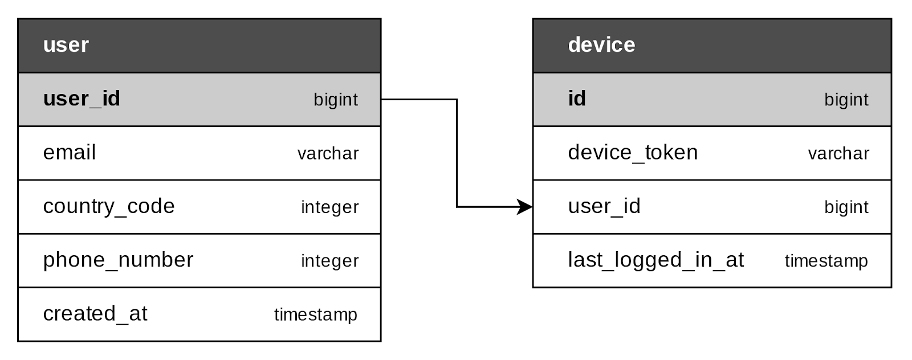
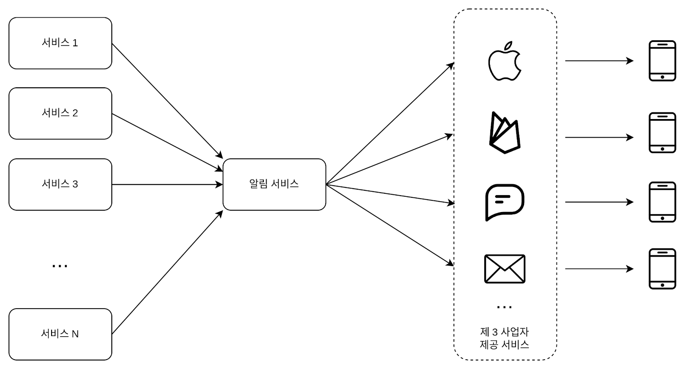
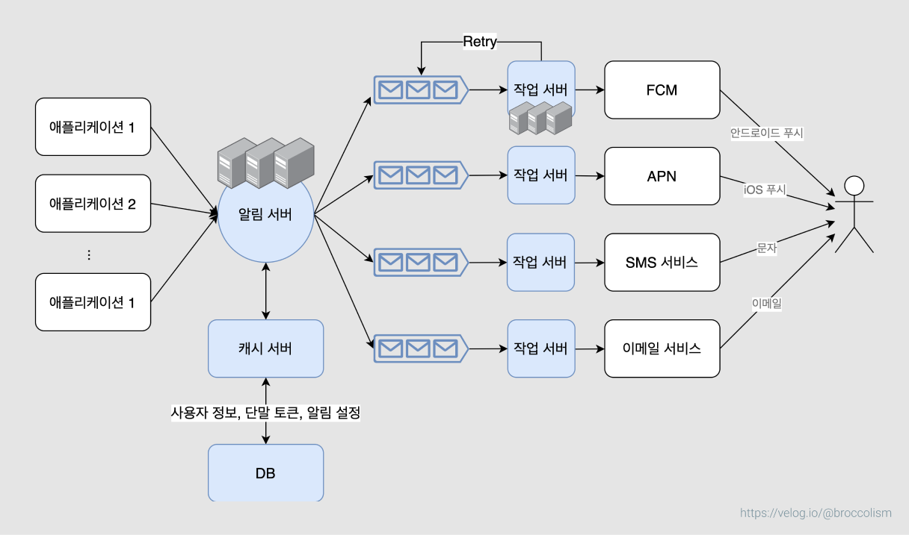

### 알림 시스템 설계

* 알림 시스템은 단순히 모바일 푸시 알림에 한정되지 않는다.
* 알림 시스템은 모바일 푸시 알림, SMS 메시지, 이메일 세 가지로 분류할 수 있다.

**문제 이해 및 설계 범위 확정**

* 하루에 백만 건 이상의 알림을 처리하는 확장성 높은 시스템을 구축하는 게 쉬운 과제는 아니다.
* 알림 시스템이 어떻게 구현되는지에 대한 깊은 이해가 필요하고, 면접에 출제될 때는 문제 자체가 모호하게 주어지므로 적절한 질문을 통해 알아내야 한다.
    * 요구 사항
        * 푸시 알림, SMS 메세지, 이메일을 지원해야한다.
        * 연성 실시간 시스템이고 높은 부하가 걸렸을 때 약간의 지연은 무방하다.
        * iOS 단말, 안드로이드 단말, 랩톱/데스크톱을 지원 해야한다.
        * 클라이언트 애플리케이션 프로그램이 알림을 만들 수 있고, 서버 측에서 스케줄링 할 수도 있다.
        * 사용자가 알림을 받지 않도록 설정할 수도 있어야 한다.
        * 하루에 천만 건의 모바일 푸시 알림, 백만 건의 SMS 메시지, 5백만 건의 이메일을 보낼 수 있어야 한다.

---

### 개략적 설계안 제시 및 동의 구하기

**iOS 푸시 알림**
* 알림 제공자: 알림 요청을 만들어 애플 푸시 알림 서비스(APNS: Apple Push Notification Service)로 보내는 주체다.
* 알림 요청을 만들려면 다음과 같은 데이터가 필요하다.
    * 단말 토큰: 알림 요청을 보내는 데 필요한 고유 식별자다.
    * 페이로드: 알림 내용을 담은 JSON 딕셔너리다. 아래는 그 예다.
```json
{
   "aps":{
      "alert":{
         "title":"Game Request",
         "body":"Bob wants to play chess",
         "action-loc-key":"PLAY"
      },
      "badge"5
   }
}
```
* APNS: 애플이 제공하는 원격 서비스다. 푸시 알림을 iOS 장치로 보내는 역할을 담당한다.
* iOS 단말: 푸시 알림을 수신하는 사용자 단말이다.

**안드로이드 푸시 알림**
* 안드로이드 푸시 알림도 비슷한 절차로 전송된다. APNS 대신 FCM(Firebase Cloud Messaging)을 사용한다는 점만 다르다.

**SMS 메시지**
* SMS 메시지를 보낼 때는 보통 트윌리오, 넥스모같은 제 3사업자의 서비스를 많이 이용한다. 이런 서비스는 대부분 상용 서비스라서 이용요금을 내야한다.

**이메일**
* 대부분의 회사는 고유 이메일 서버를 구축할 역량은 갖추고 있다.
* 그럼에도 많은 회사가 상용 이메일 서비스를 이용한다. 그중 유명한 서비스로 센드그리드, 메일침프가 있다. 전송 성공률도 높고, 데이터 분석 서비스도 제공한다.

**연락처 정보 수집 절차**
* 알림을 보내려면 모바일 단말 토큰, 전화번호, 이메일 주소 등의 정보가 필요하다.
* 사용자가 앱을 설치하거나 처음으로 계정을 등록하면 API 서버는 해당 사용자의 정보를 수집해 데이터베이스에 저장한다.
* 이메일 주소와 전화번호는 user 테이블에 저장하고, 단말 토큰은 device 테이블에 저장한다. 한 사용자가 여러 단말을 가질 수 있고, 알림은 모든 단말에 전송되어야 한다는 점을 고려했다.




**개략적 설계안 (초안)**
* 1부터 N까지의 서비스
  * 이 서비스 각각은 마이크로서비스 일 수도 있고, 크론잡일 수도 있고, 분산 시스템 컴포넌트일 수도 있다.
  * 사용자에게 납기일을 알리고자 하는 과금 서비스, 배송 알림을 보내려는 쇼핑몰 웹사이트 등이 그 예다.
* 알림 시스템
  * 알림 시스템은 알림 전송/수신 처리의 핵심이다.
  * 우선은 1개 서버만 사용하는 시스템이라고 가정해 보자.
  * 이 시스템은 서비스 1~N에 알림 전송을 위한 API를 제공해야 하고, 제3자 서비스에 전달할 알림 페이로드를 만들어 낼 수 있어야 한다.
* 제3자 서비스
  * 이 서비스들은 사용자에게 알림을 실제로 전달하는 역할을 한다.
  * 제3자 서비스와의 통합을 진행할 때 유의할 것은 확장성이다.
  * 또 하나 고려해야 할 것은, 어떤 서비스는 다른 시장에서는 사용할 수 없다. 가령 FCM은 중국에서 사용할 수 없다. 중국은 제이푸시, 푸시와이 같은 서비스를 사용해야 한다.
* iOS, 안드로이드, SMS, 이메일 단말
  * 사용자는 자기 단말에서 알림을 수신한다.



이 설계에는 몇 가지 문제가 있다.  

* SPOF
  * 알림 서비스에 서버가 하나밖에 없다는 것은, 그 서버에 장애가 생기면 전체 서비스의 장애로 이어진다는 뜻이다.
* 규모 확장성
  * 한대 서비스로 푸시 알림에 관계된 모든 것을 처리하므로, 데이터베이스나 캐시 등 중요 컴포넌트의 규모를 개별적으로 늘릴 방법이 없다.
* 성능 병목
  * 알림을 처리하고 보내는 것은 자원을 많이 필요로 하는 작업일 수 있다.
  * 예를 들어 HTML 페이지를 만들고 제3자 서비스의 응답을 기다리는 것은 시간이 많이 걸릴 가능성이 있는 작업이다.
  * 따라서 모든 것을 한 서버로 처리하면 트래픽이 몰리는 시간에 과부하 상태에 빠질 수 있다.

**개략적 설계안 (개선된 버전)**
* 데이터베이스와 캐시를 알림 시스템의 주 서버에서 분리한다.
* 알림 서버를 증설하고 자동으로 수평적 규모 확장이 이루어질 수 있도록 한다.
* 메시지 큐를 이용해 시스템 컴포넌트 사이의 강한 결합을 끊는다.



* 1부터 N까지의 서비스: 알림 시스템 서버의 API를 통해 알림을 보낼 서비스들.
* 알림 서버
  * 알림 전송 API; 스팸 방지를 위해 보통 사내 서비스 또는 기본적 검증을 수행한다.
  * 데이터베이스 또는 캐시 질의: 알림에 포함시킬 데이터를 가져오는 기능이다.
  * 알림 전송: 알림 데이터를 메시지 큐에 넣는다. 본 설계안의 경우 하나 이상의 메시지 큐를 사용하므로 알림을 병렬적으로 처리할 수 있다.
* 다음은 이메일 형태의 알림을 보내는 데 사용하는 API 에제다.
  * `POST https://api.example.com/v/sms/send`
```json
{
  "to": [
    {
      "user_id": 1234
    }
  ],
  "from": {
    "email": "from_address@example.com"
  },
  "subject": "Hello, World!",
  "content": [
    {
      "type": "text/plain",
      "value": "Hello, World!"
    }
  ]
}
```

* 캐시: 사용자 정보, 단말 정보, 알림 템플릿 등을 캐시한다.
* 데이터베이스: 사용자, 알림 설정 등 다양한 정보를 저장한다.
* 메시지 큐: 시스템 컴포넌트 간 의존성을 제거하기 위해 사용한다.
* 작업 서버: 메시지 큐에서 전송할 알림을 꺼내서 제3자 서비스로 전달하는 역할을 담당하는 서버다.

**동작 순서**
1. API를 호출해 알림 서버로 알림을 보낸다.
2. 알림 서버는 사용자 정보, 단말 토큰, 알림 설정 같은 메타데이터를 캐시나 데이터베이스에서 가져온다.
3. 알림 서버는 전송할 알림에 맞는 이벤트를 만들어서 해당 이벤트를 위한 큐에 넣는다. 가령 iOS 푸시 알림 이벤트는 iOS 푸시 알림 큐에 넣어야 한다.
4. 작업 서버는 메시지 큐에서 알림 이벤트를 꺼낸다.
5. 작업 서버는 알림을 제3자 서비스로 보낸다.
6. 제3자 서비스는 사용자 단말로 알림을 전송한다.

---

### 상세 설계
* 안정성
* 추가로 필요한 컴포넌트 및 고려사항
  * 알림 템플릿, 알림 설정, 전송률 제한, 재시도 메커니즘, 보안, 큐에 보관된 알림에 대한 모니터링과 이벤트 추적 등이 이에 해당한다.
* 개선된 설계안

**안정성**
* 분산 환경에서 운영될 알림 시스템을 설계할 때는 안정성을 확보하기 위한 사항 몇 가지를 반드시 고려해야 한다.

**데이터 손실 방지**
* 알림이 지연되거나 순서가 틀랴도 괜찮지만, 사라지만 곤란하다.
* 이를 위해 알림 데이터를 DB에 보관하고 재시도 메커니즘을 구현해야 한다.

**알림 중복 전송 방지**
* 같은 알림이 여러 번 반복되는 것을 완전히 막는 것은 가능하지 않다.
* 대부분의 경우 알림은 딱 한 번만 전송되겠지만, 분산 시스템의 특성상 가끔은 같은 알림이 중복되어 전송되기도 할 것이다.
* 중복 방지 로직 사례
  * 보내야 할 알림이 도착하면 그 이벤트 ID를 검사하여 이전에 본 적이 있는 이벤트인지 살핀다. 중복된 이벤트라면 버리고, 그렇지 않으면 알림을 전송한다.

**알림 템플릿**
* 템플릿을 사용하면 전송될 알림들의 형식을 일관성 있게 유지할 수 있고, 오류 가능성뿐 아니라 알림 작성에 드는 시간도 줄일 수 있다.

**알림 설정**
* 사용자는 이미 너무 많은 알림을 받고 있어서 쉽게 피곤함을 느낀다.
* 따라서 많은 웹사이트와 앱에서는 사용자가 알림 설정을 상세히 조정할 수 있도록 하고 있다.

**전송률 제한**
* 사용자에게 너무 많은 알림을 보내지 않도록 하는 한 가지 방법은, 한 사용자가 받을 수 있는 알림의 빈도를 제한하는 것이다.

**재시도 방법**
* 제3자 서비스가 알림 전송에 실패하면, 해당 알림을 재시도 전용 큐에 넣는다.
* 같은 문제가 발생하면 개발자에게 통지한다.

**큐 모니터링**
* 알림 시스템을 모니터링 할 때 중요한 메트릭 하나는 큐에 쌓인 알림의 개수이다.
* 이 수가 너무 크면 작업 서버들이 이벤트를 빠르게 처리하고 있지 못하다는 뜻이다.

**이벤트 추적**
* 알림 확인률, 클릭율, 실제 앱 사용으로 이어지는 비율 같은 메트릭은 사용자를 이해하는데 중요하다.
* 데이터 분석 서비스는 보통 이벤트 추적 기능도 제공한다.