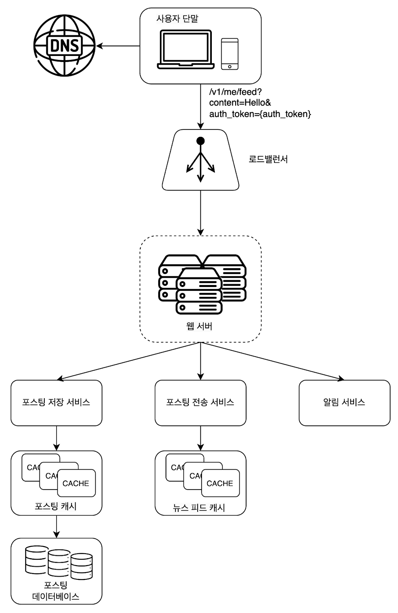

### 뉴스 피드 시스템 설계

### 문제 이해 및 설계 범위 확정
* 모바일 앱, 웹을 모두 지원해야 한다.
* 사용자는 뉴스 피드 페이지에 새로운 스토리를 올릴 수 있어야 하고, 친구들이 올리는 스토리를 볼 수도 있어야 한다.
* 뉴스 피드 순서는 단순히 시간 흐름 역순으로 표시된다.
* 한 명의 사용자는 최대 5000명의 친구를 가질 수 있다.
* 매일 천만 명이 방문한다.
* 스토리에는 이미지나 비디오 등의 미디어 파일이 포함될 수 있다.

---

### 개략적 설계안 제시 및 동의 구하기
* 피드 발행: 사용자가 스토리를 포스팅하면 해당 데이터를 캐시와 데이터베이스에 기록한다. 새 포스팅은 친구의 뉴스 피드에도 전송된다.
* 뉴스 피드 생성: 지면 관계상 뉴스 피드는 모든 친구의 포스팅을 시간 역순으로 모아서 만든다고 가정한다.

**뉴스 피드 API**
* 뉴스 피드 API는 클라이언트가 서버와 통신하기 위해 사용하는 수단이다.
* HTTP 프로토콜 기반이고, 상태 정보를 업데이트하거나, 뉴스 피드를 가져오거나, 친구를 추가하는 등의 다양한 작업을 수행하는 데 사용한다.

**피드 발행 API**
* 새 스토리를 포스팅하기 위한 API다. HTTP POST 형태로 요청을 보내면 된다.
    * `POST /v1/me/feed`
      * 인자
        * 바디: 포스팅 내용에 해당한다.
        * Authorization 헤더: API 호출을 인증하기 위해 사용된다.

**피드 읽기 API**
* 뉴스 피드를 가져오는 API다. 다음 형태를 띤다.
  * `GET /v1/me/feed`
    * 인자
      * Authorization 헤더: API 호출을 인증하기 위해 사용된다.

**피드 발행**

* 사용자: 모바일 앱이나 브라우저에서 새 포스팅을 올리는 주체다.
* 로드밸런서: 트래픽을 웹 서버들로 분산한다.
* 웹 서버: HTTP 요청을 내부 서비스로 중계하는 역할을 담당한다.
* 포스팅 저장 서비스: 새 포스팅을 데이터베이스와 캐시에 저장한다.
* 포스팅 전송 서비스: 새 포스팅을 친구의 뉴스 피드에 푸시한다. 뉴스 피드 데이터는 캐시에 보관하여 빠르게 읽어갈 수 있도록 한다.
* 알림 서비스: 친구들에게 새 포스팅이 올라왔음을 알리거나, 푸시 알림을 보내는 역할을 담당한다.