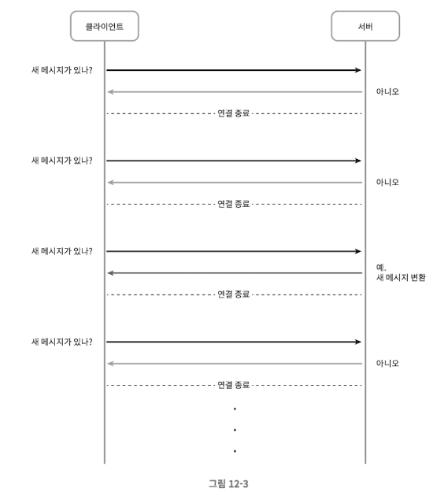
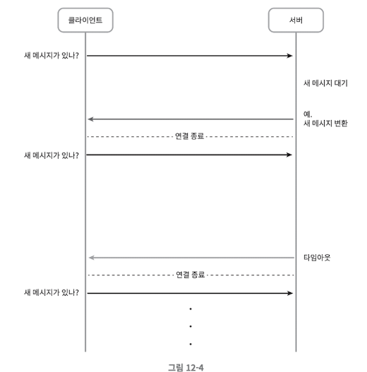
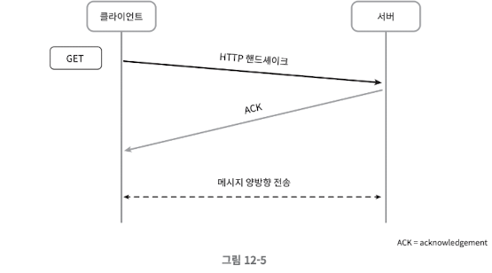
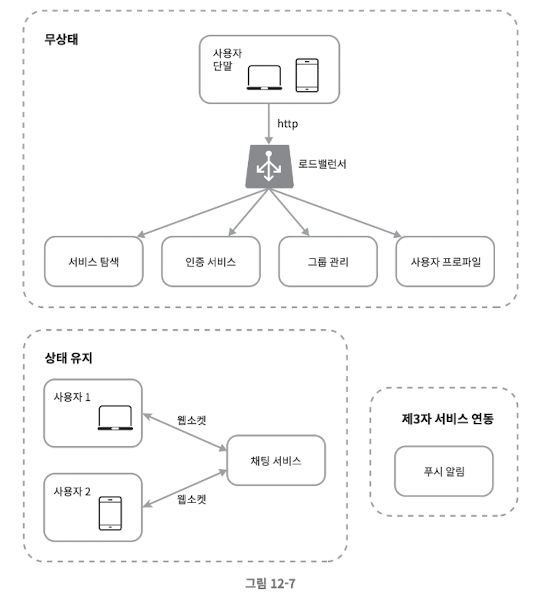

### 채팅 시스템 설계

### 문제 이해 및 설계 범위 확정
* 페이스북 메신저, 위챗, 왓츠앱처럼 1:1 채팅에 집중하는 앱들이 있는가 하면 슬랙 같은 그룹 채팅에 중점을 둔 업무용 앱이나, 게임 채팅에 쓰는 디스코드 같은 대규모 그룹의 소통과 응답지연이 낮은 음성 채팅에 집중하는 앱도 있다.
* 기능 요구 사항
  * 응답지연이 낮은 일대일 채팅 기능
  * 최대 100명까지 참여할 수 있는 그룹 채팅 기능
  * 사용자의 접속상태 표시 기능
  * 다양한 단말 지원. 하나의 계정으로 여러 단말에 동시 접속 지원
  * 푸시 알림

---

### 개략적 설계안 제시 및 동의 구하기
* 채팅 시스템의 경우 클라이언트는 모바일 앱이거나 웹 애플리케이션이다. 클라이언트는 서로 통신하지 않는다.

* **프로토콜**
  * 통신 클라이언트가 채팅 서비스에 메시지를 보낼 때 HTTP 프로토콜을 사용한다. 
  * 초기 페이스 북 메세지 앱의 송신 클라이언트는 서버에 HTTP 프로토콜을 이용해 수신 클라이언트에게 보낼 메세지를 정한다. 이 때 keep-alive 헤더를 사용하면 TCP 핸드쉐이크 횟수를 줄일 수 있다. 
  * HTTP는 클라이언트가 연결을 만드는 프로토콜이며, 서버에서 수신 클라이언트에 임의 시점에 메세지를 보낼 때는 사용하기 어렵기 때문에, 폴링, 롱 폴링, 웹소켓 등이 쓰이고 있다.
* **폴링**
  * 폴링은 수신 클라이언트가 서버에게 주기적으로 새 메세지가 있는지 물어보는 방법이다. 
  * 실제 주고 받는 글이 없음에도 불구하고 클라이언트에서 폴링이 없기 때문에 서버 자원이 불필요하게 낭비될 수 있다.

* **롱 폴링**
  * 클라이언트는 새 메시지가 반환되거나 타임아웃 될 때까지 연결을 유지한다.
  * 클라이언트는 새 메시지를 받으면 기존 연결을 종료하고 서버에 새로운 요청을 보내어 모든 절차를 다시 시작한다.
  * 메시지를 보내는 클라이언트와 수신하는 클라이언트가 같은 채팅 서버에 접속하게 되지 않을 수도 있다. HTTP 서버들은 보통 무상태 서버다. 로드 밸런싱을 위해 라운드 로빈을 사용하는 경우, 메시지를 받은 서버는 해당 메시지를 수신할 클라이언트와의 롱 폴링 연결을 가지고 있지 않은 서버일 수 있는 것이다.
  * 서버 입장에서는 클라이언트가 연결을 해제했는지 아닌지 알 좋은 방법이 없다.
  * 여전히 비효율적이다. 메시지를 많이 받지 않는 클라이언트도 타임아웃이 일어날 때마다 주기적으로 서버에 다시 접속할 것이다.

* **웹소켓**
  * 웹소켓은 서버가 클라이언트에게 비동기 메시지를 보낼 때 가장 널리 사용하는 기술이다.
  * 웹소켓 연결은 클라이언트가 시작한다. 한번 맺어진 연결은 항구적이며 양방향이다. 이 연결은 처음엔 HTTP 연결이지만 특정 핸드셰이크 절차를 거쳐 웹소켓 연결로 업그레이드 된다.
  * HTTP 프로토콜과 가장 다른 점은 양방향 통신이 가능하다는 것인데, 이 부분 떄문에 웹 소켓 대신 HTTP를 고집할 이유가 없다.

**개략적 설계안**
이 설계안에서는 클라이언트와 서버 사이의 주 통신 프로토콜로 웹소켓을 사용하기로 했지만, 다른 부분에서는 굳이 웹소켓을 쓸 필요는 없다. 사실 대부분의 기능은 일반적인 HTTP상에서 구현해도 된다.  
전체 시스템의 개략적 설계안의 경우 무상태 서비스, 상태유지 서비스, 제3자 서비스 연동의 세 부분으로 나눠서 볼 수 있다.

**무상태 서비스**  
* 로그인, 회원가입, 사용자 프로파일 표시 등을 처리하는 전통적인 요청/응답 서비스다.
* 무상태 서비스는 로드밸런서 뒤에 위치한다. 로드밸런서가 하는 일은 요청을 그 경로에 맞는 서비스로 정확하게 전달하는 것이다.

