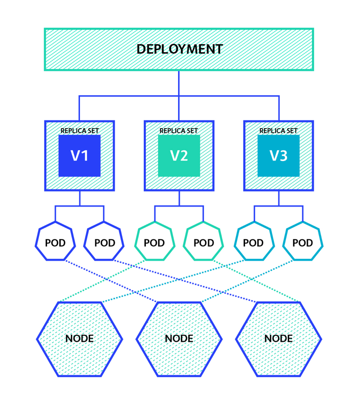
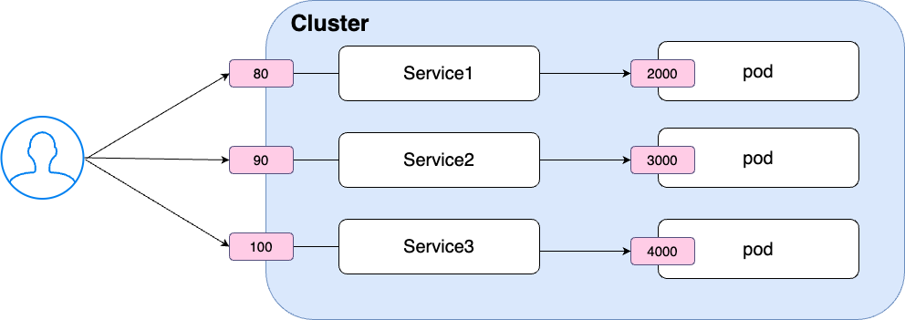

### ConfigMap
애플리케이션의 설정 값을 컨테이너에 주입하고 싶을 때 사용하는 리소스이다. `ConfigMap`을 사용하면 Pod에서 직접 환경 변수를 관리하지 않고, ConfigMap을 분리할 수 있다. 이를 통해 애플리케이션을 빌드하고 배포할 때 코드와 설정을 분리할 수 있어 더 유연한 구성 관리가 가능하다.

### 주요 개념 및 특징

1. **구성 데이터의 외부화**
    - 애플리케이션의 구성 데이터를 컨테이너 이미지에서 분리하여 관리할 수 있다. 이렇게 하면 동일한 이미지를 사용하면서도 다른 환경에 대해 다른 설정을 적용할 수 있다.
2. **구조**
    - `ConfigMap`은 키-값 쌍의 형태로 데이터를 저장한다. 각 키는 문자열이고, 각 값은 문자열 또는 파일의 내용일 수 있다.
    - 예를 들어, 데이터베이스 연결 문자열, 외부 API 엔드포인트, 또는 애플리케이션 설정 파일 등을 저장할 수 있다.

```yml
apiVersion: v1
kind: ConfigMap
metadata:
  name: authorization-minhyeok-config
  namespace: KUBE_NAMESPACE
data:
#  SPRING_PROFILES_ACTIVE: "dev"
  ELASTIC_HOST: "10.30.10.19"
  ELASTIC_PORT: "9200"
  KUBERNETES_CLUSTER_NAMESPACE: ""
  JAVA_OPTS: "-Xms2G -Xmx2G"
  ELASTIC_EXPECTED_HTTP_RESPONSE_TIME_MS: "50"
  ELASTIC_EXPECTED_REQUEST_PER_SEC: "500"
  ELASTIC_SOCKET_TIMEOUT_SEC: "60"
  ELASTIC_CONNECTION_TIMEOUT_SEC: "30"
  ELASTIC_CONNECTION_REQUEST_TIMEOUT_SEC: "30"
  ELASTIC_KEEP_ALIVE_STRATEGY_TIME_MIN: "5"
```

- **`metadata`**
    - `name`: `ConfigMap`의 이름으로, 이 `ConfigMap`을 참조할 때 사용된다.
    - `namespace`: `ConfigMap`이 속한 namespace를 지정한다.
- **`data`**
    - 이 섹션에는 애플리케이션이 필요로 하는 설정 데이터가 키-값 쌍의 형태로 저장된다. 각 키는 문자열이고, 각 값은 해당 키에 대응하는 설정 값이다.

---
### Deployment
디플로이먼트(Deployment)는 쿠버네티스에서 상태가 없는(stateless) 앱을 배포할 때 사용하는 가장 기본적인 컨트롤러이다. 쿠버네티스가 처음 등장했을 때는 Replication Controller에서 앱을 배포했는데 최근에는 디플로이먼트를 기본적적인 앱 배포에 사용한다.  
파드와 레플리카셋은 '이력'이라는 개념이 없기 때문에 릴리스 후에 변경이 없는 애플리케이션을 관리하는데 적합하다.  



즉, Deployment는 ReplicaSet의 상위 개념으로, Pod와 ReplicaSet에 대한 배포를 관리하므로 운영 중에 어플리케이션의 새 버전을 배포해야하거나 부하가 증가하면서 Pod를 추가하는 등 여러 가지 동작을 Deployment로 관리할 수 있다.

**구성**
```yml
apiVersion: apps/v1
kind: Deployment
metadata:
  name: demo-deployment
spec:
  replicas: 2
  selector:
    matchLabels:
      app: nginx
  template:
    metadata:
      labels:
        app: nginx
    spec:
      containers:
        - name: demo-container
          image: nginx:latest
```

---

### Pod

쿠버네티스에서 가장 기본적인 배포 단위로, 컨테이너를 포함하는 단위이다. 쿠버네티스의 특징 중 하나는 컨테이너를 개별적으로 하나씩 배포하는 것이 아니라 Pod라는 단위로 배포하는데, Pod는 하나 이상의 컨테이너를 포함한다.

**특징**

- Pod내의 컨테이너는 IP와 Port를 공유한다. 두개의 컨테이너가 하나의 Pod를 통해 배포되었을 때, localhost를 통해서 통신이 가능하다. 예를 들어 컨테이너 A가 8080, 컨테이너 B가 7001로 배포가 되었을 때, B에서 A를 호출할 때는 localhost:8080으로 호출하면 되고, 반대로 A에서 B를 호출할 때는 localhost:7001로 호출하면 된다.
- Pod내의 배포된 컨테이너 간 디스크 볼륨을 공유할 수 있다.

---

### Service

Pod와 볼륨을 이용해 컨테이너들을 정의하고, Pod를 서비스로 제공할 때 일반적인 분산환경에서는 하나의 Pod로 서비스 하는 경우는 드물고, 여러 개의 Pod를 서비스하면서, 이를 로드밸런서를 이용해 하나의 IP와 포트로 묶어서 서비스를 제공한다.

Pod의 경우 동적으로 생성이 되고, 장애가 생기면 자동으로 리스타트 되면서 그 IP가 바뀌기 때문에, 로드 밸런서에는 Pod의 목록을 지정할 때는 IP주소를 이용하는 것은 어렵다. 또한 오토 스케일링으로 인해 Pod가 동적으로 추가, 삭제되기 때문에 로드밸런서가 유연하게 선택해줘야 한다.

그래서 사용하는 것이 라벨과 라벨 셀렉터라는 개념이다. 서비스를 정의할 때 어떤 Pod를 서비스로 묶을 것인지를 정의하는데, 이를 라벨 셀렉터라고 한다. 각 Pod를 생성할 때 메타데이터 정보 부분에 라벨을 정의할 수 있다. 서비스는 라벨 셀렉터에서 특정 라벨을 가지고 있는 Pod만 선택해 서비스에 묶게 된다.

**구성**
```yml
apiVersion: v1
kind: Service
metadata:
  name: authorization-minhyeok-service
spec:
  selector:
    app: authorization-minhyeok
  ports:
    - protocol: TCP
      port: 8080
      targetPort: 8080
  type: ClusterIP
```

---

### Ingress


서비스는 외부 포트와 Pod포트를 포워딩하여 Pod에 트래픽이 전달되도록 한다. 그런데 한 가지 문제가 있다. 다양한 서비스가 존재하므로 다양한 포트가 외부로 노출되고, 클라이언트는 서비스별로 포트 번호를 달리해 접근해야한다. 이를 해결하기 위해 **프록시 서버**가 등장한다.


클라이언트가 프록시 서버에 요청을 보내면 프록시 서버는 경로를 기준으로 서비스를 구분한다. 클라이언트는 포트 구분 없이 원하는 서비스에 접근이 가능해진다. 이떄의 프록시 서버를 시스템 내부로 가져올 수 있는데, 이를 **리버시 프록시 서버**라 부른다. 그리고 쿠버네티스 클러스터 내부 존재하는 리버시 프록시 서버를 두고 **인그레스**라 부른다.


**인그레스 컨트롤러**  
쿠버네티스 API에 인그레스는 존재하지만 인그레스 컨트롤러는 생성되지 않는다. 클러스터가 어떤 환경이냐에 따라 적용가능한 인그레스 컨트롤러가 달라지기 때문이다.  

  
인그레스는 일종의 그릇이다 인그레스가 어떤 방식으로 동작할지는 인그레스 컨트롤러에 따라 달라진다. 인그레스를 동작시킬 구현체가 인그레스 컨트롤러인 것이다. 인그레스는 이런 다형성을 가지기에, 여러 개의 인그레스 컨트롤러를 배포하여 사용할 수 있다.  

여러 개의 인그레스 컨트롤러를 사용하는 경우, 한 가지 인그레스 컨트롤러를 디폴트로 지정해두어야 한다. 만약 인그레스에 인그레스 클래스, 즉 인그레스 컨트롤러가 지정되지 않으면 디폴트로 설정된 인그레스 컨트롤러가 지정되어 사용된다.  

**인그레스 룰**  
인그레스를 동작시킬 인그레스 컨트롤러가 정해지면 어떤 방식으로 라우팅할지 룰을 정해야한다.

**인그레스 컨트롤러 생성**
```
helm install <ingress 컨트롤러 이름 지정> ingress-nginx/ingress-nginx --namespace <설치될 네임스페이스 지정> \
--set controller.ingressClassResource.name=<리소스이름 지정> \
--set controller.ingressClassResource.controllerValue="k8s.io/<컨트롤러 값 지정>" \
--set controller.ingressClassResource.enabled=true \
--set controller.ingressClassByName=true \
```

**구성**
``` yml
apiVersion: networking.k8s.io/v1
kind: Ingress
metadata:
  name: simple-fanout-example
spec:
  rules:
  - host: foo.bar.com
    http:
      paths:
      - path: /foo
        pathType: Prefix
        backend:
          service:
            name: service1
            port:
              number: 4200
      - path: /bar
        pathType: Prefix
        backend:
          service:
            name: service2
            port:
              number: 8080
```

쿠버네티스 클러스터가 구성되면 쿠버네티스 API에 인그레스가 생성된다. 인그레스는 마치 빈그릇과 같은데, 개발자가 선택한 환경에 따라 적합한 형태로 동작하도록 인그레스 컨트롤러를 선택할 수 있다. 환경에 적합한 인그레스 컨트롤러가 배포되면 인그레스 컨트롤러에 라우팅룰을 적용해야 한다. 라우팅룰이 저장된 인그레스 리소스를 kubectl apply 명령어 인그레스 컨트롤러에 적용한다. 그러면 인그레스가 리버스 프록시 서버로 동작할 준비가 완료된다.  

---

### 정리
- **ConfigMap**은 Kubernetes에서 애플리케이션의 설정 데이터를 관리하기 위한 리소스
- **Deployment**는 클러스터 내부에서 애플리케이션을 실행하고 관리
- **Service**는 애플리케이션을 클러스터 내부 또는 외부에서 접근할 수 있도록 하는 네트워크 엔드포인트를 제공
- **Ingress**는 클러스터 외부에서 들어오는 HTTP(S) 트래픽을 클러스터 내부의 특정 서비스로 라우팅
    - Ingress를 작성하지 않더라도 서비스 자체를 띄우고 포트 포워딩을 통해 서비스에 접속 가능

클러스터의 desired state를 기술한 Deployment, 이를 네트워크 서비스로 노출시키는 Service, 클러스터 외부에서 클러스터 내부의 서비스로 접근할 수 있게 만들어주는 Ingress, 그리고 애플리케이션의 설정 데이터를 관리하여 환경에 따라 설정을 유연하게 적용할 수 있게 해주는 것이 ConfigMap이다.
